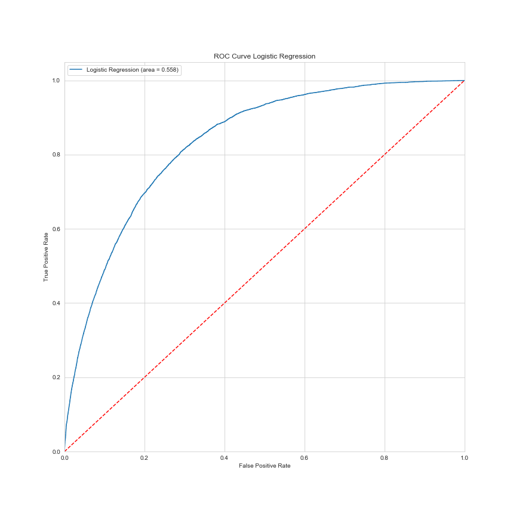

# Heart Diseaseor Attack Classification

Details will be added soon.

Predicting that the patient is suffering from Heart Disease or Myocardial Infarction (MI) based on various parameters.

| **2 Component PCA** | **3 Component PCA**  |
|--|--|
|  |  |

     

