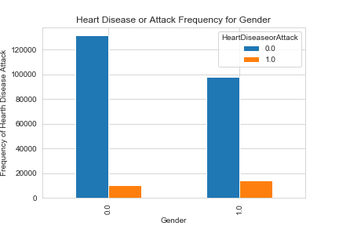

# Heart Diseaseor Attack Classification

## Problem Statement

Predicting that the patient is having **coronary heart disease (CAD)** or **myocardial infarction (MI)** based on various parameters. The dataset ***originally has 330 features (columns),*** but based on heart disease research regarding factors influencing heart disease and other chronic health conditions, only select features are included in this analysis. 

Various algorithms have been created and tested in order to answer and solve the following questions. If you want to help me in finding a solution, please do not hesitate to help me.

#### **1. To what extend can survey responses from the BRFSS be used for predicting heart disease risk?**

#### **2. Can a subset of questions from the BRFSS be used for preventative health screening for diseases like heart disease?**

---

### What is coronary artery disease (CAD)?

Coronary artery disease (CAD) is the most common type of heart disease in the United States. It is sometimes called coronary heart disease or ischemic heart disease.

For some people, the first sign of CAD is a  [heart attack](https://www.cdc.gov/heartdisease/heart_attack.htm). You and your health care team may be able to help reduce your risk for CAD.

### What causes coronary artery disease (CAD)?

CAD is caused by plaque buildup in the walls of the arteries that supply blood to the heart (called coronary arteries) and other parts of the body.

Plaque is made up of deposits of  [cholesterol](https://www.cdc.gov/cholesterol/)  and other substances in the artery. Plaque buildup causes the inside of the arteries to narrow over time, which can partially or totally block the blood flow. This process is called **atherosclerosis**.

### What are the symptoms of coronary artery disease (CAD)?

**Angina**, or chest pain and discomfort, is the most common symptom of CAD. Angina can happen when too much plaque builds up inside arteries, causing them to narrow. Narrowed arteries can cause chest pain because they can block blood flow to your heart muscle and the rest of your body.

For many people, the first clue that they have CAD is a  [heart attack](https://www.cdc.gov/heartdisease/heart_attack.htm). Symptoms of heart attack include

-   Chest pain or discomfort (angina).
-   Weakness, light-headedness, nausea (feeling sick to your stomach), or a cold sweat.
-   Pain or discomfort in the arms or shoulder.
-   Shortness of breath.

Over time, CAD can weaken the heart muscle. This may lead to heart failure, a serious condition where the heart can’t pump blood the way it should.

### What are the risks for coronary artery disease (CAD)?

Overweight, physical inactivity, unhealthy eating, and smoking tobacco are risk factors for CAD. A family history of heart disease also increases your risk for CAD, especially a family history of having heart disease at an early age (50 or younger).

To find out your risk for CAD, your health care team may measure your blood pressure, blood cholesterol, and blood sugar levels.

[Learn more about heart disease risk factors](https://www.cdc.gov/heartdisease/risk_factors.htm).

### What is cardiac rehabilitation and recovery?

[Cardiac rehabilitation](https://www.cdc.gov/heartdisease/cardiac_rehabilitation.htm)  (rehab) is an important program for anyone recovering from a heart attack, heart failure, or other heart problem that required surgery or medical care. In these people, cardiac rehab can help improve quality of life and can help prevent another cardiac event. Cardiac rehab is a supervised program that includes

-   Physical activity.
-   Education about healthy living, including healthy eating, taking medicine as prescribed, and ways to help you quit smoking.
-   Counseling to find ways to relieve stress and improve mental health.

A team of people may help you through cardiac rehab, including your health care team, exercise and nutrition specialists, physical therapists, and counselors or mental health professionals.

### How can I be healthier if I have coronary artery disease (CAD)?

If you have CAD, your health care team may suggest the following steps to help lower your risk for heart attack or worsening heart disease:

-   Lifestyle changes, such as eating a healthier (lower sodium, lower fat) diet, increasing physical activity, reaching a healthy weight, and quitting smoking
-   Medicines to treat risk factors for CAD, such as high cholesterol, high blood pressure, or an irregular heartbeat
-   Surgical procedures to help restore blood flow to the heart.

---

### What is myocardial infarction (MI)?

A **myocardial infarction** (**MI**), commonly known as a **heart attack**, occurs when [blood flow](https://en.wikipedia.org/wiki/Hemodynamics "Hemodynamics") decreases or stops to the [coronary artery](https://en.wikipedia.org/wiki/Coronary_artery "Coronary artery") of the [heart](https://en.wikipedia.org/wiki/Heart "Heart"), causing damage to the [heart muscle](https://en.wikipedia.org/wiki/Cardiac_muscle "Cardiac muscle").

     

### What causes of a myocardial infarction (MI)?

The blockage is caused by a buildup of plaque in the arteries ([atherosclerosis](https://www.hopkinsmedicine.org/healthlibrary/conditions/adult/cardiovascular_diseases/atherosclerosis_85,P00197)). Plaque is made up of deposits,  [cholesterol](https://www.hopkinsmedicine.org/healthlibrary/conditions/adult/cardiovascular_diseases/cholesterol_in_the_blood_85,P00220), and other substances. When a plaque breaks (ruptures), a blood clot quickly forms. The blood clot is the actual cause of the heart attack.

If the blood and oxygen supply is cut off, muscle cells of the heart begin to suffer damage and start to die. Irreversible damage begins within 30 minutes of blockage. The result is heart muscle affected by the lack of oxygen no longer works as it should.

### Two types of myocardial infarction (MI)
| Inherited (or genetic) | Acquired |
|--|--|
| Inherited or genetic risk factors are risk factors you are born with that cannot be changed, but can be improved with medical management and lifestyle changes. | Acquired risk factors are caused by activities that we choose to include in our lives that can be managed through lifestyle changes and clinical care. |

### Prevention of myocardial infarctions (MI)

**You can help prevent a heart attack by knowing your risk factors for coronary artery disease and heart attack and taking action to lower those risks.** Even if you’ve already had a heart attack or are told that your chances of having a heart attack are high, you can still lower your risk, most likely by making a few lifestyle changes that promote better health.

-   Don’t smoke. Your doctor may recommend methods for quitting, including nicotine replacement.
-   Eat a diet low in fat, cholesterol and salt.
-   See your doctor regularly for blood pressure and cholesterol monitoring.
-   Pursue a program of moderate, regular aerobic exercise. People over age 50 who have led a sedentary lifestyle should check with a doctor before beginning an exercise program.
-   Lose weight if you are overweight.
-   Your doctor may advise you to take a low dose of aspirin regularly. Aspirin reduces the tendency for the blood to clot, thereby decreasing the risk of heart attack. However, such a regimen should only be initiated under a doctor’s expressed recommendation.
-   Women at or approaching menopause should discuss the possible cardio-protective benefits of estrogen replacement therapy with their doctor.

### Symptoms of a myocardial infarction (MI)

The following are the **most common symptoms of a heart attack**. But each person may have slightly different symptoms.

-   Severe pressure, fullness, squeezing, pain, or discomfort in the center of the chest that lasts for more than a few minutes
-   Pain or discomfort that spreads to the shoulders, neck, arms, or jaw
-   Chest pain that gets worse
-   Chest pain that doesn't get better with rest or by taking nitroglycerin
-   Chest pain that happens along with any of these symptoms:
    -   Sweating, cool, clammy skin, or paleness
    -   Shortness of breath
    -   Nausea or vomiting
    -   Dizziness or fainting
    -   Unexplained weakness or fatigue
    -   Rapid or irregular pulse

Although chest pain is the key warning sign of a heart attack, it may be confused with other conditions. These include indigestion, pleurisy, pneumonia, tenderness of the cartilage that attaches the front of the ribs to the breastbone, and heartburn. Always see your healthcare provider for a diagnosis.

Sources:

 1. https://www.hopkinsmedicine.org/health/conditions-and-diseases/heart-attack
 2. https://www.cdc.gov/heartdisease/coronary_ad.htm
 3. https://en.wikipedia.org/wiki/Myocardial_infarction

## Dataset

Dataset (***heart_disease_health_indicators_BRFSS2015.csv***) was downloaded from [Kaggle](https://www.kaggle.com/alexteboul/heart-disease-health-indicators-dataset) website. You can find the details of the dataset in that website . Dataset has **22 columns** and **253680 rows without the header**. You can see the metadata information on [Kaggle metadata](https://www.kaggle.com/alexteboul/heart-disease-health-indicators-dataset/metadata).

| Column | Details |
|--|--|
| HeartDiseaseorAttack | Respondents that have ever reported having coronary heart disease (CHD) or myocardial infarction (MI) |
| HighBP | Adults who have been told they have high blood pressure by a doctor, nurse, or other health professional |
| HighChol | Have you EVER been told by a doctor, nurse or other health professional that your blood cholesterol is high? |
| CholCheck | Cholesterol check within past five years |
| BMI | Body Mass Index (BMI) |
| Smoker | Have you smoked at least 100 cigarettes in your entire life? [Note: 5 packs = 100 cigarettes] |
| Stroke | (Ever told) you had a stroke. |
| Diabetes | 0 is no diabetes, 1 is pre-diabetes, and 2 is diabetes |
| PhysActivity | Adults who reported doing physical activity or exercise during the past 30 days other than their regular job |
| Fruits | Consume Fruit 1 or more times per day |
| Veggies | Consume Vegetables 1 or more times per day |
| HvyAlcoholConsump | Heavy drinkers (adult men having more than 14 drinks per week and adult women having more than 7 drinks per week) |
| AnyHealthcare | Do you have any kind of health care coverage, including health insurance, prepaid plans such as HMOs, or government plans such as Medicare, or Indian Health Service? |
| NoDocbcCost | Was there a time in the past 12 months when you needed to see a doctor but could not because of cost? |
| GenHlth | Would you say that in general your health is? [from 1 to 5] |
| MentHlth | Now thinking about your mental health, which includes stress, depression, and problems with emotions, for how many days during the past 30 days was your mental health not good? [from 1 to 30] |
| PhysHlth | Now thinking about your physical health, which includes physical illness and injury, for how many days during the past 30 days was your physical health not good? [from 1 to 30] |
| DiffWalk | Do you have serious difficulty walking or climbing stairs? |
| Sex | Indicate sex of respondent. [Female: 0, Male: 1]|
| Age | Fourteen-level age category [from 1 to 14]|
| Education | What is the highest grade or year of school you completed? [from 1 to 6] |
| Income | Is your annual household income from all sources: (If respondent refuses at any income level, code "Refused.") |

## Methodology

In this project,  results were obtained through:

 - **XGBoost**  
 - **Artificial neural networks (ANN)**
 - **Logistic regression**
 - **Principal component analysis (PCA)**
 - **Linear discriminant analysis (LDA)**
 

## Analysis

| # | Column | Non-Null Count | Dtype |
|--|--|--|--|
| 0 | HeartDiseaseorAttack | 229781 non-null | float64
| 1 | HighBP | 229781 non-null | float64
| 2 | HighChol | 229781 non-null | float64
| 3 | CholCheck | 229781 non-null | float64
| 4 | BMI | 229781 non-null | float64
| 5 | Smoker | 229781 non-null | float64
| 6 | Stroke | 229781 non-null | float64
| 7 | Diabetes | 229781 non-null | float64
| 8 | PhysActivity | 229781 non-null | float64
| 9 | Fruits | 229781 non-null | float64
| 10 | Veggies | 229781 non-null | float64
| 11 | HvyAlcoholConsump | 229781 non-null | float64
| 12 | AnyHealthcare | 229781 non-null | float64
| 13 | NoDocbcCost | 229781 non-null | float64
| 14 | GenHlth | 229781 non-null | float64
| 15 | MentHlth | 229781 non-null | float64
| 16 | PhysHlth | 229781 non-null | float64
| 17 | DiffWalk | 229781 non-null | float64
| 18 | Sex | 229781 non-null | float64
| 19 | Age | 229781 non-null | float64
| 20 | Education | 229781 non-null | float64
| 21 | Income | 229781 non-null | float64

**dtypes: float64(22)
memory usage: 40.3 MB**

You can see the gender distribution of the respondents in the pie chart below. Since the rate of respondents is a close value, we can make assumptions for both genders.

The proportions of the participants who suffer from the disorder over their gender can be seen on the histogram below.

     

---

### Artificial Neural Networks

The keras model was created as indicated in the image above. Since the model output is binary, the **binary_crossentropy** loss function is used. The model is saved as **model.h5**. When necessary, you can operate this model without the need for re-fit.

     

#### Confusion Matrix:
      
| 67364 | 601 |
|--|--|
| **7141** | **722** |

**True positive: 67364**

**False positive: 601**

**False negative: 7141**

**True Negative: 722**

Mean of classifier accuracy: 
**0.8990771770477295**

Accuracy score: 
**0.8979005116843383**

During the fit of the model, the validation probability and the validation loss graph were formed as follows.

| Validaton Accuracy | Validation Loss |
|--|--|
|  |  |

Artifical neural networks prediction for the first row in dataset:

**Model predicted as [[0]].**

### XGBoost

In addition to artificial neural networks (ANN), the **HeartDiseaseorAttack** class of the participants was predicted by the extreme gradient boosting (XGBoost) method.

#### Confusion Matrix:
      
| 67095 | 6871 |
|--|--|
| **870** | **992** |

**True positive: 67095**

**False positive: 6871**

**False negative: 870**

**True Negative:  992**

Accuracy score(XGBoost): 
**0.8979136994250145**

XGBoost prediction for the first row in dataset:
**[[0.29755485]].**

Process took 148.80871844291687 seconds.

---

### Logistic Regression

In addition, the logistic regression method was used for prediction processes. In the following sections, optimum results are sought with K-Fold Cross Validation and Grid Search for the linear model.

Accuracy of logistic regression classifier: 
**0.898**

#### Confusion Matrix:
      
| 67114 | 851 |
|--|--|
| **6855** | **1008** |

**True positive: 67114**

**False positive: 851**

**False negative: 6855**

**True Negative:  1008**

#### Classification report

| # | precision | recall | f1-score | support |
|--|--|--|--|--|
|  **0.0** | 0.91 | 0.99 | 0.95 | 67965 |
| **1.0** | 0.54 | 0.13 | 0.21 | 7863 |
| **accuracy** |  |  | 0.90 | 75828 |
| **macro avg** | 0.72 | 0.56 | 0.58 | 75828 |
| **weighted avd** | 0.87 | 0.90 | 0.87 | 75828 |

The best possible estimation method yields a point in the upper left corner or coordinate of the ROC field (0.1), representing 100% sensitivity (no false negatives) and 100% specificity (no false positives). The point (0,1) is also called perfect classification. Since the ROC curve draws a curve close to the specified corner (0.1), we can say that our classification is successful.

#### K-Fold Cross Validation

The mean of success of our classification and the standard deviation of the mean of success were obtained by K-Fold Cross Valdation.

Success Mean:
**0.8989107073875381**

Success Standard Deviation:
**0.00042449075040278605**

#### Grid Search

Parameters

    p = [{'tol':[1e-4,1e-3,1e-2], 'C':[1,2,3]},
     {'tol':[1e-4,1e-3,1e-2], 'C':[1,2,3]},
     {'tol':[1e-4,1e-3,1e-2], 'C':[1,2,3]},
     {'tol':[1e-4,1e-3,1e-2], 'C':[1,2,3]}]

Evaluation was made with the tool that gives the **most successful result for your classification and evaluates the parameters with the values ​​we have specified**. On the below you can see grid search results that gave us the most successful results.

Best result:
 **0.8989626703998119**
Best parameters:
**{'C': 3, 'tol': 0.0001}**

Process took 31.47452998161316 seconds.

---

### Principal component analysis (PCA) and Linear discriminant analysis (LDA) with Logistic Regression

Finally, size reduction was made with the Principal component analysis (PCA) and Linear discriminant analysis (LDA) methods. 21 different independent variables were **reduced to 2 and 3 independent variables**.

| **2 Component PCA** | **3 Component PCA**  |
|--|--|
|  |  |

### Principal component analysis (PCA)

---

 ### 1. 2 Dimensional PCA

***Actual / Without PCA Confusion Matrix :***

| 67114 | 851 |
|--|--|
| **6855** | **1008** | 

**True positive: 67114**

**False positive: 851**

**False negative: 6855**

**True Negative:  1008**

Accuracy score: 
**0.8983752703486839**

***Actual / With PCA Confusion Matrix :***

| 67413 | 552 |
|--|--|
| **7213** | **650** | 

**True positive: 67413**

**False positive: 552**

**False negative: 7213**

**True Negative:  650**

Accuracy score:
**0.8975971936487841**

***Before PCA and After PCA Confusion Matrix***
| 73488 | 481 |
|--|--|
| **1138** | **721** | 

**True positive: 73488**

**False positive: 481**

**False negative: 1138**

**True Negative:  721**

Accuracy score: 
**0.9786490478451232**

---

### 2. 3 Dimensional PCA

| 67114 | 851 |
|--|--|
| **6855** | **1008** | 

**True positive: 67114**

**False positive: 851**

**False negative: 6855**

**True Negative:  1008**

Accuracy score: 
**0.8983752703486839**

***Actual / With PCA Confusion Matrix :***

| 67415 | 550 |
|--|--|
| **7212** | **651** | 

**True positive: 67415**

**False positive: 550**

**False negative: 7212**

**True Negative:  651**

Accuracy score:
**0.8976367568708129**

***Before PCA and After PCA Confusion Matrix***
| 73476 | 493 |
|--|--|
| **1151** | **708** | 

**True positive: 73476**

**False positive: 493**

**False negative: 1151**

**True Negative:  708**

Accuracy score: 
**0.9783193543282165**

Process took 2.5799081325531006 seconds. (heart_disease_pca_lda_3d.py)

---

### Linear Discriminant Analysis (LDA)

***LDA and Actual Confusion Matrix :***

| 73103 | 866 |
|--|--|
| **564** | **1295** |

**True positive: 73103**

**False positive: 866**

**False negative: 564**

**True Negative:  1295**

Accuracy score: 
**0.9811415308329376**

Process took 4.972307443618774 seconds. (heart_disease_pca_lda)

## How to Run Code

Before running the code make sure that you have these libraries:

 - pandas 
 - time
 - sklearn
 - seaborn
 - warnings
 - xgboost
 - matplotlib
 - keras
 - ann_visualizer
 - mpl_toolkits
 - statistics
    
## Contact Me

If you have something to say to me please contact me: 

 - Twitter: [Doguilmak](https://twitter.com/Doguilmak)  
 - Mail address: doguilmak@gmail.com
